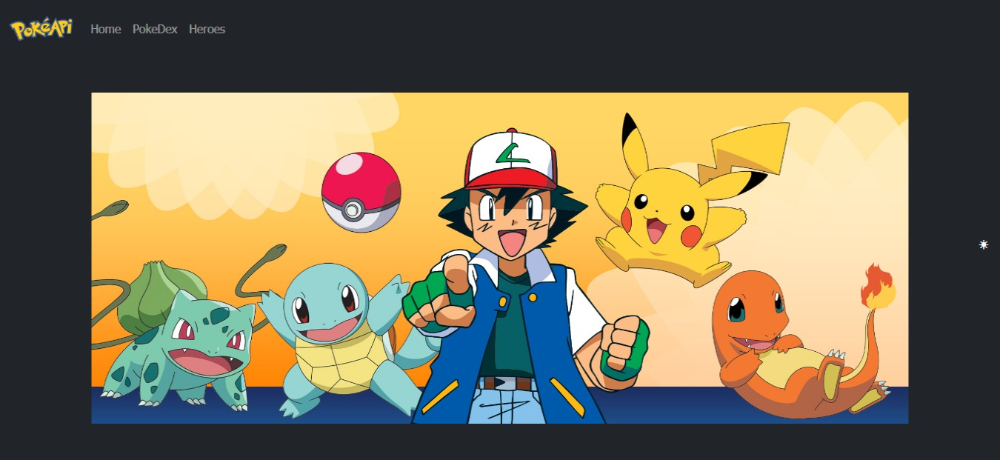
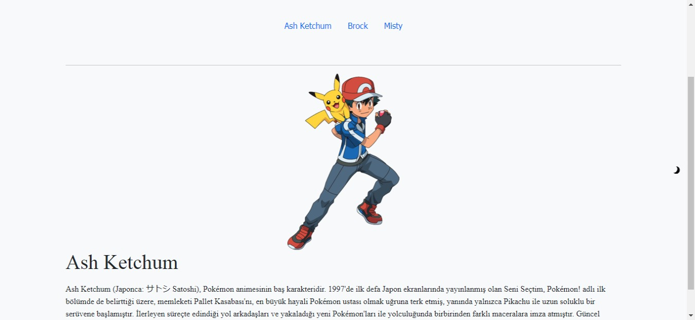
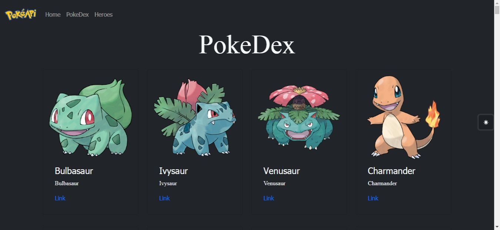
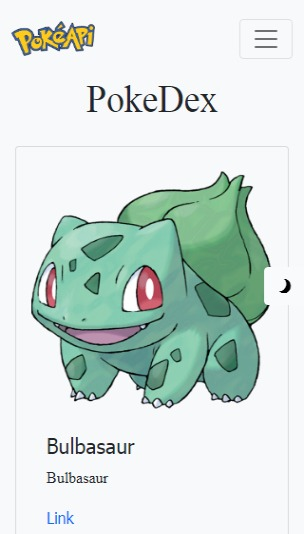

# Pokemon App

## Live
[Netfily](https://loving-ritchie-ebc3cf.netlify.app/)

## How to Get Started

```
$ git clone https://github.com/ercumentlacin/pokemon-app
$ cd /pokemon-app
$ npm install
$ npm start

```

## Note
- It continues to be developed.
- UseParams and: slug are used in this app.

## Tech
React Pokemon App uses a number of libraries.
- [ReactJS](https://reactjs.org/) - Frontend Library for awesome apps!
- [Bootstrap5](https://getbootstrap.com/) - The world’s most popular front-end open source toolkit

## ScreenShots

### Desktop 


### Heroes 



### Pokodex 



### Mobile 



